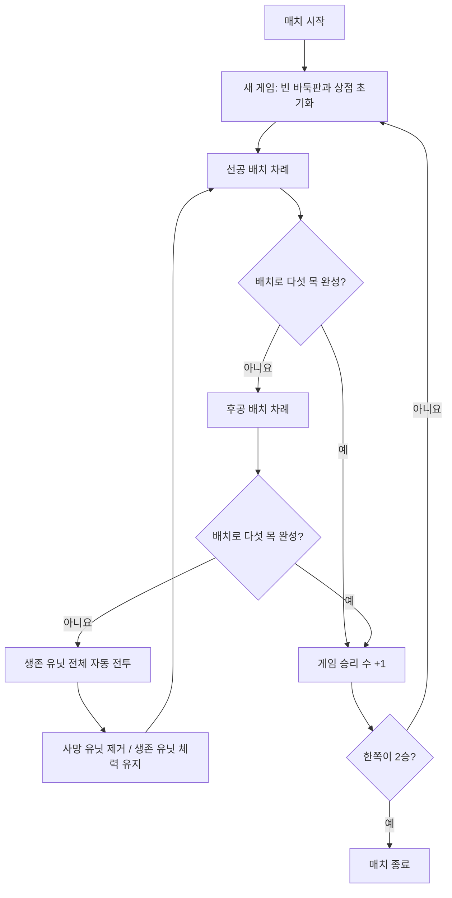

# 게임 기획서 — 가칭 《오목 오토배틀》

> 문서 버전: 0.1
>
> 상태: 콘셉트 초안 / 핵심 규칙 협의 중
>
> 기준일: 2026-08-07

## 1. 문서 표기

- **확정**: 현재까지 합의된 방향
- **제안**: 프로토타입 제작을 위한 권장안
- **결정 필요**: 구현 전에 사용자 확인이 필요한 규칙

## 2. 게임 한 줄 소개

상점에서 역할이 다른 오목알을 골라 배치하고, 제자리에서 벌이는 자동 전투로 상대 진형을 제거하면서 먼저 다섯 목을 완성하는 싱글 플레이 전략 게임.

## 3. 게임 개요

| 항목 | 내용 | 상태 |
| --- | --- | --- |
| 장르 | 오목 + 상점 기반 오토배틀 전략 | 확정 |
| 기본 모드 | 플레이어 대 오목 COM | 확정 |
| 최종 목표 | 가로·세로·대각선 중 한 방향으로 아군 알 5개 연결 | 확정 |
| 매치 승리 | 최대 3게임 중 먼저 2게임 승리 | 확정 |
| 핵심 선택 | 5칸 상점, 유닛 선택, 리롤, 배치 위치 | 확정 |
| 전투 | 양측이 알을 하나씩 둔 뒤, 보드 위 생존 유닛 전체가 제자리에서 자동 전투 | 확정 |
| 유닛 능력치 | 체력, 공격력, 사거리 | 확정 |
| 초기 플랫폼 | PC | 제안 |
| 플레이 형태 | 싱글 플레이 | 확정 |

## 4. 핵심 재미

### 4.1 오목의 즉각적인 전술

규칙을 아는 플레이어라면 별도의 학습 없이도 공격선 만들기, 상대의 사목 막기, 이중 위협 만들기를 이해할 수 있어야 한다.

### 4.2 제한된 상점에서 만드는 즉흥 전략

항상 원하는 알을 둘 수 없기 때문에 상점에 나온 5개 중 현재 판세에 맞는 역할을 선택해야 한다. 리롤은 나쁜 선택지를 바꿀 기회를 주지만 자원을 소비한다.

### 4.3 배치가 곧 전투 진형

오목을 위한 위치 선정이 동시에 탱커의 보호 범위, 근거리 딜러의 공격 가능 위치, 원거리 딜러와 힐러의 안전을 결정해야 한다.

### 4.4 짧고 읽기 쉬운 자동 전투

플레이어가 개입하지 않아도 왜 특정 알이 버티고, 공격하고, 쓰러졌는지 알아볼 수 있어야 한다. 전투 연출은 전략 결과를 설명하는 역할을 한다.

## 5. 용어

라운드라는 표현의 중복을 피하기 위해 다음 용어를 사용한다.

| 용어 | 정의 |
| --- | --- |
| 매치 | 최대 3게임 중 먼저 2게임을 이기면 끝나는 전체 대결 |
| 게임 | 빈 바둑판에서 시작해 한쪽이 다섯 목을 완성할 때까지의 한 판 |
| 사이클 | 플레이어와 COM이 각각 알 하나를 배치하고 전투까지 마치는 단위 |
| 배치 차례 | 한쪽이 상점을 이용하고 알 하나를 놓는 단계 |
| 전투 | 한 사이클의 두 배치가 끝난 뒤 진행되는 자동 전투 |
| 오목알 / 유닛 | 바둑판에 놓이며 전투 능력치를 가진 말 |

## 6. 전체 진행 구조



## 7. 오목 규칙

### 7.1 기본 규칙

- 두 진영은 동일한 바둑판의 빈 교차점에 번갈아 알을 놓는다.
- 가로, 세로, 두 대각선 중 한 방향으로 같은 진영의 알 5개가 연속되면 승리한다.
- 이미 알이 있는 위치에는 새 알을 놓을 수 없다.
- 한 번 확정한 배치는 플레이어가 임의로 취소할 수 없다.
- 알을 놓은 직후 새로 놓은 알을 포함한 다섯 목이 완성되면 해당 진영이 즉시 승리한다.
- 전투 종료 시점에는 오목 승리를 판정하지 않는다.

### 7.2 확정 규칙

- 바둑판은 **15×15**를 사용한다.
- 장목(6개 이상 연결)도 승리로 인정하는 자유룰을 사용한다.
- 삼삼, 사사, 장목 금수와 같은 렌주룰은 적용하지 않는다.
- 매 게임마다 선공을 교대한다.
- 한 게임 안에서는 표준 오목처럼 선공과 후공이 끝까지 한 수씩 번갈아 둔다.
- 선공과 후공이 각각 한 번 배치하면 자동 전투를 시작한 뒤 같은 순서로 다음 사이클을 진행한다.

### 7.3 결정 필요

- 빈 교차점이 하나도 없고 어느 쪽도 다섯 목을 만들지 못한 예외 상황의 처리

## 8. 상점과 경제

### 8.1 확정 규칙

- 상점에는 무작위 오목알 5개가 표시된다.
- 플레이어는 5개 중 하나를 무료로 선택해 현재 배치 차례에 즉시 놓는다.
- 유닛 구매와 벤치는 사용하지 않는다.
- 고정 지급되는 골드를 지불해 상점 5칸을 리롤할 수 있다.
- 처치 수나 전투 성과로 추가 골드를 지급하지 않는다.
- 동일 유닛 합성은 MVP에서 제외한다.
- COM도 동일한 규칙 안에서 유닛을 선택한다.

### 8.2 배치 차례의 상점 흐름

1. 첫 배치 차례가 아니라면 고정 골드 1을 받는다.
2. 무료로 자동 갱신된 상점의 유닛 5개를 확인한다.
3. 필요하면 골드를 사용해 5칸 전체를 리롤한다. 보유 골드가 있는 동안 횟수 제한 없이 반복할 수 있다.
4. 유닛 하나를 무료로 선택한다.
5. 선택한 유닛을 빈 교차점에 놓고 배치를 확정한다.

유닛을 선택한 뒤에도 배치를 확정하기 전까지는 상점 선택으로 돌아갈 수 있다. 배치가 확정되면 해당 차례의 상점 이용은 종료된다. 사용하지 않은 골드는 상한 없이 다음 배치 차례로 이월된다. 같은 상점 안에 동일한 유닛이 여러 번 등장할 수 있다.

게임 시작 시 2골드를 보유한다. 첫 배치 차례에는 추가 수입을 받지 않으며, 두 번째 자신의 배치 차례부터 매번 1골드를 받는다.

### 8.3 MVP 경제 수치

| 항목 | 값 | 상태 |
| --- | ---: | --- |
| 게임 시작 골드 | 2 | 확정 |
| 자신의 배치 차례 고정 수입 | 1 | 확정 |
| 리롤 비용 | 1 | 확정 |
| 최대 보유 골드 | 제한 없음 | 확정 |
| 미사용 골드 이월 | 제한 없이 이월 | 확정 |
| 상점 칸 수 | 5 | 확정 |
| 유닛 선택 비용 | 0 | 확정 |
| 한 배치 차례의 배치 수 | 1 | 확정 |
| 벤치 | 없음 | 확정 |
| 배치 차례 시작 시 무료 갱신 | 1회 | 확정 |
| 한 차례의 유료 리롤 횟수 | 보유 골드 내에서 제한 없음 | 확정 |
| 동일 유닛 중복 등장 | 허용 | 확정 |
| 처치·전투 성과 보상 | 없음 | 확정 |
| 합성·이자·연승 보너스 | MVP에서 제외 | 확정 |

### 8.4 추가 검토 기능

- 상점 잠금
- 유닛 풀과 희귀도별 등장 확률
- 동일 유닛 3개 합성 및 등급 상승
- 연승·연패 보너스, 이자, 전투 성과 보상

합성, 경험치, 상점 레벨까지 한 번에 도입하면 오목보다 경제 관리의 비중이 커지므로 MVP에서는 제외한다.

## 9. 유닛 설계

### 9.1 공통 능력치

| 능력치 | 역할 |
| --- | --- |
| 체력 | 피해를 버틸 수 있는 양 |
| 공격력 | 기본 공격 한 번의 피해량 |
| 회복량 | 힐러가 회복 행동 한 번에 각 대상에게 회복하는 체력 |
| 사거리 | 공격 가능한 거리 |
| 공격 간격 | 자동 전투에서 공격하는 주기. 전투 구현에 필수인 파생 능력치 |

거리 계산은 직선과 대각선을 동일한 1칸으로 취급한다. 두 유닛의 가로 칸 차이와 세로 칸 차이 중 큰 값을 거리로 사용한다.

```text
거리 = max(|가로 좌표 차이|, |세로 좌표 차이|)
```

따라서 사거리 1인 유닛은 자신을 둘러싼 8칸을 공격할 수 있다.

### 9.2 MVP 역할군

상점에는 역할 이름만 표시되는 것이 아니라 역할을 가진 구체적인 캐릭터가 등장한다. MVP에서는 역할당 캐릭터 1종만 제작해 총 4종으로 시작한다.

| 역할 | 전투 성격 | 강점 | 약점 | 고유 규칙 |
| --- | --- | --- | --- | --- |
| 탱커 | 공격을 대신 받아냄 | 높은 체력, 아군 보호 | 낮은 공격력 | 적은 자신의 사거리 안에 있는 탱커를 다른 공격 가능 대상보다 우선 선택 |
| 근접 딜러 | 가까운 적을 빠르게 처치 | 높은 공격력 | 짧은 사거리 | 별도 능력 없음 |
| 힐러 | 생존한 아군을 회복 | 진형 유지 | 공격 능력 없음 | 일정 시간마다 사거리 안의 부상당한 아군 전체를 회복 |
| 원거리 딜러 | 먼 거리에서 안정적으로 공격 | 넓은 사거리 | 낮은 체력 | 별도 능력 없이 넓은 기본 사거리 보유 |

이후 역할별 캐릭터와 고유 스킬을 늘릴 수 있지만, MVP에서는 위 4종으로 전투 문법을 먼저 검증한다.

### 9.3 MVP 초기 능력치

| 역할 | 체력 | 공격/회복량 | 사거리 | 행동 주기 |
| --- | ---: | ---: | ---: | ---: |
| 탱커 | 200 | 공격 10 | 1 | 공격 1.5초 |
| 근접 딜러 | 100 | 공격 30 | 1 | 공격 1초 |
| 힐러 | 80 | 회복 15 | 2 | 회복 2초 |
| 원거리 딜러 | 70 | 공격 18 | 3 | 공격 1.2초 |

위 수치는 구현을 시작하기 위한 기준값이며 플레이 테스트 결과에 따라 조정한다. 힐러의 회복량 15는 범위 안의 각 부상당한 아군에게 개별 적용된다.

### 9.4 시각 규칙

- 모든 유닛은 흑·백 진영을 즉시 구분할 수 있어야 한다.
- 역할은 실루엣, 테두리 형태, 아이콘으로 구분한다.
- 체력바와 공격·회복 대상 표시를 제공한다.
- 오목 연결선이 전투 효과에 가려지지 않도록 보드 가독성을 우선한다.

## 10. 자동 전투

### 10.1 확정 규칙

- 양쪽이 각각 알 하나를 배치한 뒤 자동 전투를 시작한다.
- 전투는 제한 시간 동안 진행된다.
- 유닛은 자신의 능력치와 역할 규칙에 따라 자동으로 행동한다.

### 10.2 확정 전투 모델

1. 유닛은 배치된 교차점에 고정되며 전투 중 이동하지 않는다.
2. 사거리 안에 들어온 적만 공격할 수 있다.
3. 양측이 알을 하나씩 배치하면 보드 위의 모든 생존 유닛이 전투에 참여한다.
4. 체력이 0이 된 유닛은 즉시 사망하며 바둑판에서도 제거된다.
5. 생존한 유닛은 잃은 체력을 회복하지 않고 다음 사이클로 가져간다.
6. 전투 후에는 오목을 판정하지 않는다. 다음 배치로 다섯 목을 완성해야 승리한다.

이 구조에서 각 유닛은 디펜스 게임의 고정 타워처럼 행동한다. 전투는 상대의 연결을 끊고 다음 오목 수를 보호하기 위한 소모전이 된다.

### 10.3 기본 행동 우선순위

1. 행동할 때마다 사거리 안의 생존한 적을 공격 가능 후보로 수집한다.
2. 후보 중 탱커가 있으면 탱커만 남긴다.
3. 남은 후보 중 가장 가까운 적을 선택한다.
4. 거리가 같은 적이 여러 명이면 현재 체력이 가장 낮은 적을 선택한다.
5. 공격 가능한 적이 없으면 아무 행동도 하지 않고 대기한다.
6. 힐러는 적을 공격하지 않는다. 적의 유무와 관계없이 사거리 안의 부상당한 아군 전체를 2초마다 회복하고, 회복할 아군이 없으면 대기한다.

### 10.4 전투 종료 조건 제안

- 제한 시간 도달
- 어느 한쪽의 생존 유닛이 모두 사망
- 전투가 일정 시간 교착 상태일 때 조기 종료

MVP 전투 제한 시간은 **10초**로 시작해 플레이 테스트로 조정한다. 한쪽 유닛이 전멸해 전투가 조기 종료되더라도 게임 패배로 처리하지 않는다. 다음 사이클에 새 유닛을 배치하며 게임을 계속한다.

### 10.5 결정 필요

- 목표 우선순위까지 같은 적이 여러 명일 때의 최종 선택 규칙
- 시간 종료 시 진행 중인 공격과 회복을 즉시 중단하는지
- 같은 시점에 치명타를 주고받은 공격을 상호 적용할지

## 11. 승리와 매치 구조

### 11.1 게임 승리

자신의 배치 차례에 새 알을 놓아 같은 진영의 알 5개 이상을 연결하면 즉시 게임에서 승리한다. 선공이 승리 조건을 달성해도 동일하며, 승리가 확정된 경우 상대의 남은 배치나 해당 사이클의 전투는 진행하지 않는다. 유닛 전멸은 별도의 승리 조건이 아니다.

### 11.2 매치 승리 규칙

- 먼저 2게임을 이기는 진영이 매치에서 승리한다.
- 최대 3게임의 2선승제로 진행한다.
- 게임이 끝날 때마다 보드, 유닛, 골드, 상점을 모두 초기화한다.
- 다음 게임에는 직전 게임의 후공이 선공한다.
- MVP에서는 인위적인 최대 사이클 수나 장기전 무승부를 두지 않는다.

매치 사이에 영구 강화가 유지되면 먼저 이긴 쪽의 눈덩이 효과가 커질 수 있으므로 초기 버전에서는 게임마다 완전히 초기화한다. 지나치게 긴 게임은 전투 능력치와 유닛 밸런스를 조정해 해결한다.

## 12. 오목 COM

### 12.1 목표

COM은 단순히 빈칸에 무작위 배치하지 않고, 오목 위협과 전투 결과를 함께 고려해야 한다. 플레이어와 동일한 상점, 골드, 리롤 규칙을 사용하며 정보를 부당하게 미리 보지 않는다.

### 12.2 의사결정 순서

1. 즉시 다섯 목을 만들 수 있으면 승리 수를 둔다.
2. 플레이어의 즉시 승리 수가 있으면 막는다.
3. 열린 사목, 이중 삼목 등 위협 점수를 계산한다.
4. 후보 칸에서 유닛 역할과 주변 아군·적군의 전투 가치를 평가한다.
5. 상점의 5개 유닛 중 후보 칸의 기대 점수가 가장 높은 유닛을 선택한다.
6. 기대 점수가 기준보다 낮고 골드가 충분하면 제한 횟수 내에서 리롤한다.

### 12.3 후보 칸 평가식 초안

```text
총점 = 즉시 승리/방어 점수
     + 오목 공격 형태 점수
     + 오목 방어 형태 점수
     + 예상 생존 점수
     + 아군 역할 시너지
     - 상대 공격 노출도
     + 소량의 무작위성
```

### 12.4 난이도 조절

| 난이도 | 탐색 및 행동 |
| --- | --- |
| 쉬움 | 1수 평가, 높은 무작위성, 리롤 적게 사용 |
| 보통 | 주요 후보를 2수 앞까지 평가, 전투 예상 반영 |
| 어려움 | 더 넓은 후보와 깊은 탐색, 경제 최적화, 낮은 무작위성 |

MVP는 규칙 기반 휴리스틱 COM으로 시작하고, 필요할 때 후보 수를 제한한 미니맥스 또는 몬테카를로 탐색을 추가한다.

## 13. 화면 구성 초안

### 13.1 전투/배치 메인 화면

- 중앙: 15×15 바둑판과 유닛
- 하단: 상점 5칸, 리롤 버튼, 보유 골드
- 상단: 플레이어와 COM의 게임 승리 수, 현재 선공, 전투 타이머
- 측면 또는 툴팁: 선택 유닛의 역할, 체력, 공격력, 사거리, 능력
- 전투 중: 상점과 배치 입력 잠금, 전투 속도 및 일시정지 버튼은 추후 검토

### 13.2 결과 화면

- 완성된 오목 연결선 강조
- 해당 게임 승자와 현재 매치 스코어 표시
- 다음 게임 또는 매치 결과로 이동

## 14. MVP 범위

### 14.1 반드시 포함

- 15×15 오목판과 기본 배치
- 가로·세로·대각선 다섯 목 판정
- 무작위 5칸 상점과 리롤
- 탱커, 근접 딜러, 힐러, 원거리 딜러 각 1종
- 능력치 기반 자동 전투
- 기본 휴리스틱 COM
- 최대 3게임의 2선승 매치 진행
- 배치, 전투, 게임 결과를 이해할 수 있는 최소 UI

### 14.2 MVP에서 제외

- 온라인 멀티플레이
- 복잡한 합성 및 상점 레벨
- 아이템 장착
- 대규모 유닛 로스터
- 메타 성장, 수집, 시즌 시스템
- 고급 연출과 최종 아트

## 15. 초기 밸런스 원칙

- 오목 수가 명백히 좋은데 상점 운 때문에 놓지 못하는 좌절을 줄인다.
- 전투력이 높은 유닛이 언제나 오목 위협보다 우선되지 않게 한다.
- 한 번의 전투 패배로 완성 직전의 진형 전체가 사라지지 않도록 사망 속도를 제한한다.
- 탱커와 힐러만으로 전투가 무한히 늘어지지 않게 최대 시간과 치유량을 조절한다.
- 리롤은 유용하지만 매 차례 정답이 되지 않는 비용이어야 한다.
- 선공과 후공의 승률을 기록하고 선후공 교대 규칙을 조정한다.

## 16. 주요 위험

| 위험 | 영향 | 대응 방향 |
| --- | --- | --- |
| 전투가 오목 결과에 약하게 연결됨 | 자동 전투가 장식처럼 느껴짐 | 사망으로 연결을 끊고 누적 피해로 진형 유지에 영향 부여 |
| 전투가 너무 강함 | 좋은 오목 수보다 유닛 등급이 중요해짐 | 전투 시간과 사망 수 제한, 역할 상성 완화 |
| 상점 운이 큼 | 전략보다 운으로 승패가 결정됨 | 역할 보정, 확정 기본 유닛, 리롤 안전장치 |
| COM 계산량 증가 | 배치 대기 시간이 길어짐 | 후보 칸 가지치기, 평가 캐시, 난이도별 탐색 제한 |
| 전투 중 보드 가독성 저하 | 오목 판세를 읽기 어려움 | 원위치 표시, 연결선 강조, 효과 밀도 제한 |
| 패배가 누적되는 눈덩이 | 역전 가능성 감소 | 게임별 경제 초기화, 전투 사망 규칙 조정 |

## 17. 우선 결정 질문

### P0 — 코어 규칙

1. 빈 교차점이 하나도 없는데 다섯 목이 없는 예외 상황은 무승부로 처리하는가?
2. 10초 종료 시점에 시작됐지만 아직 적용되지 않은 공격과 회복은 취소하는가?
3. 같은 시각에 양쪽이 치명타를 주고받으면 양쪽 피해를 모두 적용하는가?
4. 모든 조건이 같은 공격 대상이 여러 명이면 먼저 배치된 유닛을 선택하는가?

### P1 — 오목과 매치

5. 무승부 게임이 발생하면 승리 수 변화 없이 같은 선공 순서로 다시 시작하는가?

### P1 — 상점과 경제

9. 상점 잠금 기능을 MVP에 포함하는가?
10. 유닛마다 희귀도와 등장 확률이 다른가?

### P2 — 표현과 세계관

13. 게임의 분위기와 세계관은 진지한 판타지, 캐주얼, 동양풍 중 어느 방향인가?
14. 흑·백 양쪽이 동일 유닛을 공유하는가, 진영별 고유 유닛이 있는가?
15. 목표 플레이 시간은 매치 기준 몇 분인가?

## 18. 결정 기록

| 날짜 | 결정 | 이유 |
| --- | --- | --- |
| 2026-08-06 | 오목과 오토배틀을 결합 | 최초 콘셉트 |
| 2026-08-06 | 5칸 무작위 상점과 리롤 사용 | 오토체스 선택 문법 적용 |
| 2026-08-06 | 유닛에 체력, 공격력, 사거리 부여 | 역할 기반 자동 전투 구성 |
| 2026-08-06 | 플레이어 대 오목 COM 우선 개발 | 초기 게임 모드 범위 확정 |
| 2026-08-06 | 최대 5게임의 3선승 구조를 초기안으로 검토 | 2026-08-07에 2선승제로 변경 |
| 2026-08-06 | 유닛은 배치된 자리에서 이동하지 않음 | 디펜스 게임처럼 고정 진형 사용 |
| 2026-08-06 | 체력이 0인 유닛은 보드에서 제거 | 전투가 오목 진형에 직접 영향 |
| 2026-08-06 | 오목은 배치 직후 판정 | 알을 놓아 완성한 진영이 승리 |
| 2026-08-06 | 생존 유닛의 체력은 회복되지 않음 | 사이클 사이의 누적 피해 유지 |
| 2026-08-06 | 모든 생존 유닛이 매 전투 참여 | 보드 전체 진형을 전투에 반영 |
| 2026-08-07 | 직선과 대각선을 동일한 1칸으로 계산 | 사거리 1은 주변 8칸에 적용 |
| 2026-08-07 | 사거리 안에 적이 없으면 대기 | 고정형 디펜스 전투 규칙 유지 |
| 2026-08-07 | 배치로 오목 완성 시 즉시 승리 | 후속 배치와 전투를 생략 |
| 2026-08-07 | 유닛 전멸 후에도 게임 진행 | 오목만을 게임 승리 조건으로 유지 |
| 2026-08-07 | MVP 전투 제한 시간은 10초 | 초기 플레이 테스트 기준값 |
| 2026-08-07 | 상점에서 유닛 하나를 무료로 선택 | 구매와 벤치 없는 간단형 상점 사용 |
| 2026-08-07 | 골드는 고정 지급 | 처치와 전투 성과에 따른 눈덩이 방지 |
| 2026-08-07 | 동일 유닛 합성은 MVP에서 제외 | 코어 오목·전투 검증에 집중 |
| 2026-08-07 | 시작 골드 2, 배치 차례마다 1골드 지급 | 리롤 전용 경제의 기본 수입 |
| 2026-08-07 | 미사용 골드는 상한 없이 이월 | 장기적인 리롤 자원 축적 허용 |
| 2026-08-07 | 상점은 매 배치 차례 무료 갱신 | 매 차례 새로운 선택지 제공 |
| 2026-08-07 | 보유 골드 내에서 연속 리롤 허용 | 원하는 선택지를 탐색할 자유 제공 |
| 2026-08-07 | 상점 내 동일 유닛 중복 허용 | 적은 초기 유닛 종류를 고려 |
| 2026-08-07 | 첫 배치 차례는 시작 골드 2만 사용 | 두 번째 자신의 배치부터 1골드 지급 |
| 2026-08-07 | 상점에는 구체적인 캐릭터가 등장 | 역할은 캐릭터 분류로 사용 |
| 2026-08-07 | MVP는 역할당 캐릭터 1종 | 탱커, 근접 딜러, 힐러, 원거리 딜러로 시작 |
| 2026-08-07 | 탱커는 적의 공격 우선 대상 | 고정 진형에서 아군 보호 역할 수행 |
| 2026-08-07 | 근접 딜러는 별도 능력 없음 | 높은 기본 공격력과 짧은 사거리로 구분 |
| 2026-08-07 | 힐러는 주기적으로 범위 내 아군 회복 | 적이 없어도 회복 행동 수행 |
| 2026-08-07 | 원거리 딜러는 별도 능력 없음 | 넓은 기본 사거리로 구분 |
| 2026-08-07 | 탱커 우선 공격은 공격 가능 범위 안에서 적용 | 사거리 규칙을 무시한 강제 공격 방지 |
| 2026-08-07 | 힐러는 범위 내 부상 아군 전체 회복 | 2초마다 대상별 체력 15 회복 |
| 2026-08-07 | 힐러는 공격하지 않음 | 회복 대상이 없으면 대기 |
| 2026-08-07 | 공격 대상은 탱커, 거리, 낮은 체력 순으로 선택 | 자동 전투 목표 선택 규칙 확정 |
| 2026-08-07 | MVP 4종 초기 능력치 사용 | 구현 후 플레이 테스트로 조정 |
| 2026-08-07 | 한 게임은 표준 오목 순서 유지 | 선공과 후공이 끝까지 번갈아 배치 |
| 2026-08-07 | 15×15 자유룰 사용 | 장목 승리, 삼삼·사사 금수 없음 |
| 2026-08-07 | 매치는 최대 3게임의 2선승제 | 게임마다 모든 진행 상태 초기화 |
| 2026-08-07 | 장기전 제한은 MVP에서 사용하지 않음 | 전투 수치 밸런스로 경기 길이 조정 |
